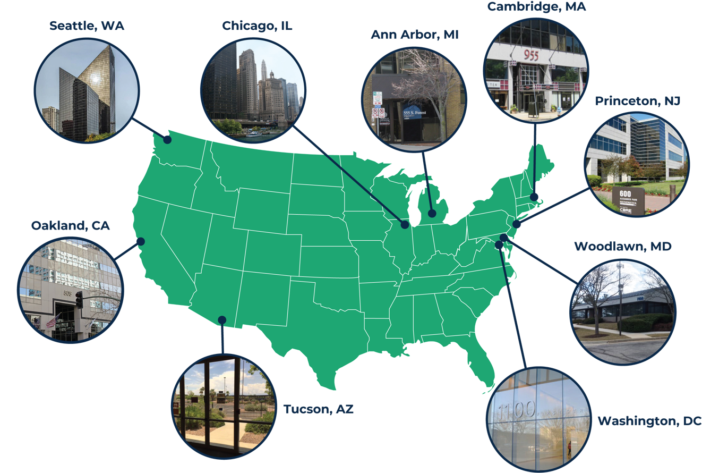
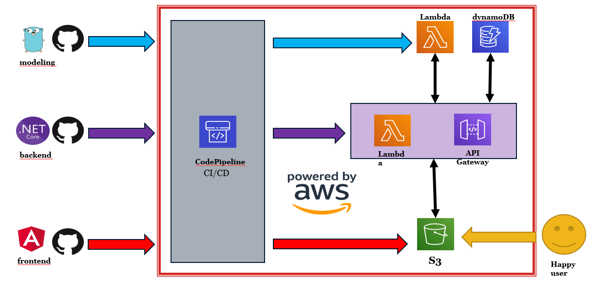
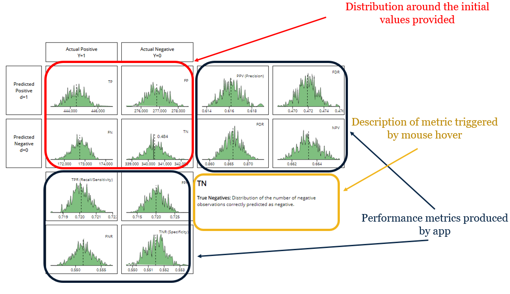

#  About Mathematica 

+ Established in 1968
+ We are the insight partner that illuminates the path to progress for public and private sector changemakers .
+ 1,200+ employees
+ Our experts dive into urgent social challenges with rigor and objectivity to surface evidence and understanding that weathers the toughest tests.
+ **Employee-owned since 1986**
+ Reimagining the way the world gathers and uses data, we uncover the evidence that offers our partners the confidence and clarity they need to find out what can be done, how to make it happen, and where to go next.

---
#  Our Office Locations 

---
#  Data Science at Mathematica 

+ Remote, virtual community of 40+ staff
	+ Born out of statistics
+ Primarily concentrated in healthcare
+ Close connections to data engineers, researchers, and developers
+ What defines the community?
	+ Training (tooling, methods, reproducible research)
	+ User groups and chatrooms
	+ Knowledge management
	+ Data acquisition
	+ Strategic investments
[Born out of statistics](https://amstat.tandfonline.com/doi/full/10.1080/00031305.2016.1255256#.XVwBX-hKiUk)

---
#  Agenda 

+ Background
+ How it works in theory
+ How it works in practice
+ Demo
+ Concluding remarks & next steps

---
#  Background 

---
#  Confusion matrix 

+ Machine learning algorithms used to predict binary outcomes rely on the confusion matrix to compare and validate models

---
#  Application to ethics 

+ Work by Mitchell et al. suggests the use of an augmented confusion matrix to assess algorithmic fairness by comparing metric performance across groups

---
#  Motivating example 

+ COMPAS
	+ C orrectional O ffender M anagement P rofiling for A lternative S anctions
	+ Tool to help judges, probation and parole officers assess a criminal defendant?s likelihood to re-offend (recidivism)
+ ProPublica analysis
	+ Study of 10,000 criminal records in the state of Florida
	+ Compared predicted recidivism rate to actual recidivism rate of defendants
	+ Showed  it disproportionally incorrectly flag black defendants compared to white defendants

---
#  How to assess unfairness of COMPAS 

+ Compare rates between two subgroups: black and white defendants
+ COMPAS claims rates between groups match
	+ Positive Predicted Value (PPV) = accurate classification as higher risk
	+ Negative Predicted Value (NPV) = accurate classification as lower risk
+ ProPublica claims rates between groups do not match
	+ False Negative Rates (FNR) = misclassification as lower risk
	+ False Positive Rates (FPR) = misclassification as higher risk

---
#  How certain are we that an algorithm is unfair? 

+ Current applications of confusion matrix approach to assessing fairness ignore uncertainty
+ Potential problems
	+ Small sample sizes
		+ Results for small sample sizes are inherently more uncertain than for larger sample sizes
	+ Low prevalence
		+ It can be especially tricky to assess performance of an algorithm that handles events with a low prevalence

---
#  Our contribution 

+ Framework for assessing algorithmic fairness with uncertainty
+ Builds on work from Mitchell et al. on augmented confusion matrix for AI fairness
+ Free, automated tool that is customizable to your data
+ Built on AWS, powered by Bayesian-flavored Monte Carlo models

---
#  How it works in theory 

---
#  Overview 

---

# Architecture

---
#  The models 

+ Our method takes a sample from our two Poisson distributions, feeds them in the Beta distribution, and takes a sample from this distribution.
+ We repeat this process in its entirety for each sample from the Beta distribution, so that the Beta distribution gets re-defined entirely with every draw.
+ We then build a distribution with each of our Beta samples.

---
#  How it works in practice 

---
#  User input 

+ **Population** refers to the general population.
	+ This is not necesarily a sample.
+ **Prevalence** is the prevalence of the condition in the general population.
	+ Similarly to the population, this number can be different than the prevalence in the sample you used in your study.
+ The values in the **confusion matrix (true positive, false positive, false negative and true negative)**
	+ This should come from the sample you used in your study.

---
#  Output 

+ Distribution around the initial values provided
+ Description of metric triggered by mouse hover
+ Performance metrics produced by app

---
#  Demo 

---
#  COMPAS 

---
#  Demo! 

+ http://www.ethics-mathematica.com/
[http://www.ethics-mathematica.com/](http://www.ethics-mathematica.com/)

---
#  Black defendants 

---
#  White defendants 

---
#  Summary 

+ FNR
	+ ProPublica suggests white defendants who did get rearrested were nearly twice as likely to be misclassified as low risk
	+ Face validity: app shows bias (W: 0.371 ; B:0.220) but shows a less drastic difference
+ FPR
	+ ProPublica suggests black defendants who did not get rearrested were nearly twice as likely to be misclassified as higher risk
	+ Face validity: app shows bias ( W: 0.735 ; B: 0.99) but shows a less drastic difference
+ PPV
	+ COMPAS argues that their algorithm satisfied calibration, which is similar to equal PPV and equal NPV
	+ Face validity: app confirms the similarities between the two groups on this metric
		+ PPV (W: 0.690 ; B: 0.616)
		+ NPV (W: 0.384 ; B: 0.336)

---
#  Next steps & concluding remarks 

---
#  Next steps 

+ Application to other topics
+ Storyboard
+ Relaxing distributional assumptions
+ Testing edge cases

---
#  Conclusion 

+ Free, open-source tool for AI ethics
+ Bayesian flavor provides uncertainty estimates
+ Feedback welcome!
	+ [abohl@mathematica-mpr.com](mailto:abohl@mathematica-mpr.com)
	+ Github
		+ [Mathematica- mpr /sampler](https://github.com/mathematica-mpr/sampler)
		+ [Mathematica- mpr /sampler-spa](https://github.com/mathematica-mpr/sampler-spa)
		+ [Mathematica- mpr /sampler- api](https://github.com/mathematica-mpr/sampler-api)

---
#  Additional info 

---
#  References	 

+ Fairness in AI
  + [Mitchell et al.](https://arxiv.org/pdf/1811.07867v2.pdf)
  +  [Reflections on Quantitative Fairness](https://shiraamitchell.github.io/fairness)
+ COMPAS study
	+ [ProPublica's main article](https://www.propublica.org/article/machine-bias-risk-assessments-in-criminal-sentencing)
	+ [ProPublica's detailed article](https://www.propublica.org/article/how-we-analyzed-the-compas-recidivism-algorithm)
	+ [ProPublica's Github](https://github.com/propublica/compas-analysis)

---
#  Model 

---
#  The model(s) 

+ A Beta distribution that provides the probability of true positives, true negatives, false negatives and false positives in our population.
+ This Beta distribution takes two parameters, alpha and beta, which signify the number of ?successes? and ?failures?, respectively.
+ This distribution is centered around values of alpha and beta for each pane of the confusion matrix.
+ For example, the distribution of true positives will be centered around the fraction of true positives to false negatives.
+ with our probability with mean
+ For the distribution of true positives, we would have:

---
#  The model(s) 

+ Each parameter of the Beta distribution has a Poisson prior.
+ The Poisson distribution is centered around a mean provided by the input values of alpha and beta.
+ For the distribution of true positives, we would have:

---
#  The model(s) 

+ Now that we our Beta distribution defined, and pinned by our two Poisson priors, we can start sampling!
+ Our method takes a sample from our two Poisson distributions, feeds them in the Beta distribution, and takes a sample from this distribution.
+ We repeat this process in its entirety for each sample from the Beta distribution, so that the Beta distribution gets re-defined entirely with every draw.
+ We then build a distribution with each of our Beta samples.

